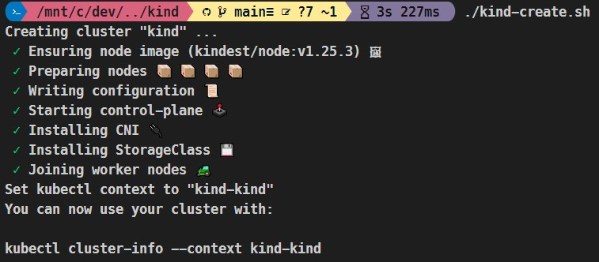

# Kind
kind is a tool for running local Kubernetes clusters using Docker container “nodes”.
https://kind.sigs.k8s.io/

## Prerequisties
- [WSL2](https://kind.sigs.k8s.io/docs/user/using-wsl2/#setting-up-wsl2)
- [Docker](./docs/DOCKER.md)

## Kind Install
```bash
# Install on Linux (WSL2 Ubuntu)
curl -Lo ./kind https://kind.sigs.k8s.io/dl/v0.17.0/kind-linux-amd64
chmod +x ./kind
sudo mv ./kind /usr/local/bin/kind
```

## Clone scripts
```bash
git clone https://bitbucket.forge.avaya.com/scm/metam/kind.git
cd kind
```

## Create local Kubernetes cluster
```bash
./kind-create.sh
```


## Connect to Kubernetes cluster
```bash
# By default kind creates/updates $HOME/.kube/config
kubectl cluster-info --context kind-kind

# Optionally you can output to seperate file $HOME/.kube/kind/config
./kind-kubeconfig.sh
export KUBECONFIG="$HOME/.kube/kind/config"
kubectl get nodes
```

## Deploy an Ingress (Optional)
```bash
# Helm
helm repo add ingress-nginx https://kubernetes.github.io/ingress-nginx
helm repo update
helm upgrade --install ingress-nginx ingress-nginx/ingress-nginx \
   --version 4.6.0 \
   --set controller.service.type=NodePort \
   --set controller.service.nodePorts.http=30080 \
   --set controller.service.nodePorts.https=30443
helm status ingress-nginx

# Access Service
# Use hostPort of kind node, to work the containerPort and the Kubernetes service nodePort need to be equal.
curl localhost:80
curl localhost:443
```

## Destroy Kubernetes cluster
```bash
./kind-delete.sh
```

# References:
- https://kind.sigs.k8s.io/docs/user/quick-start/
- https://kind.sigs.k8s.io/docs/user/using-wsl2/
