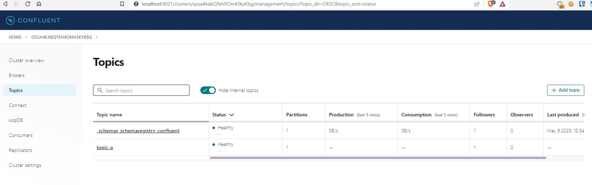

# Overview

Deploys Confluent for Kubernetes (CFK)

Each component can be optionally toggled off.

By default it deploys 1 ZooKeeper, 1 Kafka, 1 Kafka Connect, 1 SchemaRegistry, 1 ControlCenter




# Confluent Platform to Kafka Versions

The current version is 7.4.0 with is Kafka 3.4
ref: https://docs.confluent.io/platform/current/installation/versions-interoperability.html

# Pre Pull Images

Confluent Images are large enough to make it slow to have Kind always pull the Confluent images.

Instead it is better to pull the images locally and load them into the kind cluster nodes.

```bash
# Load Confluent Images into Kind
./confluent-load-images-to-kind.sh
```

# Create Kafka cluster

```bash
# Create Kafka Cluster
./confluent-create.sh

# View Control Center
./confluent-create.sh
```

# Create Kafka Topic

```bash
# Create Topics
./confluent-create-topics.sh
```

# Create Kafka Schemas

```bash
# Create Topics
./confluent-create-schemas.sh
```

# Delete Kafka cluster

```bash
# Delete Kafka Cluster
./confluent-delete.sh
```

# References

- https://docs.confluent.io/operator/current/co-quickstart.html
